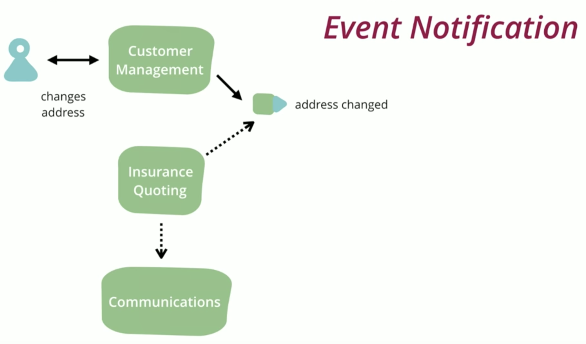
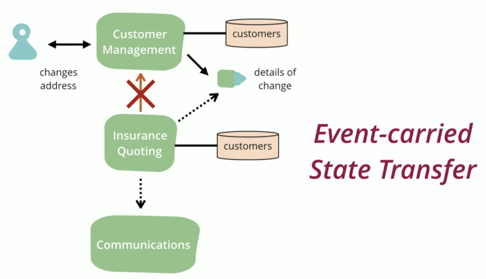
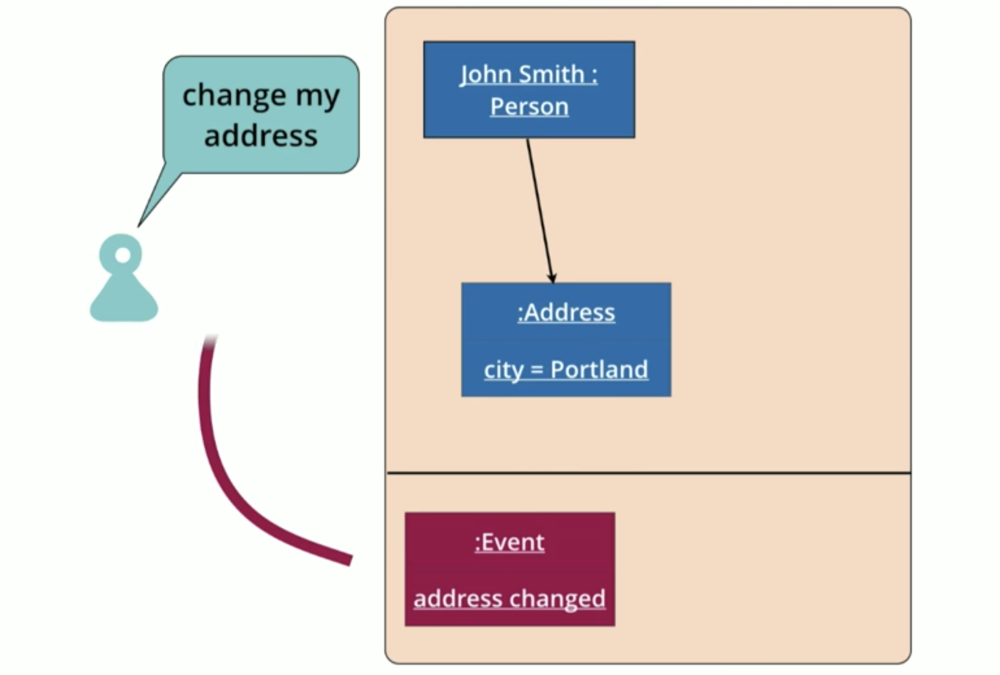
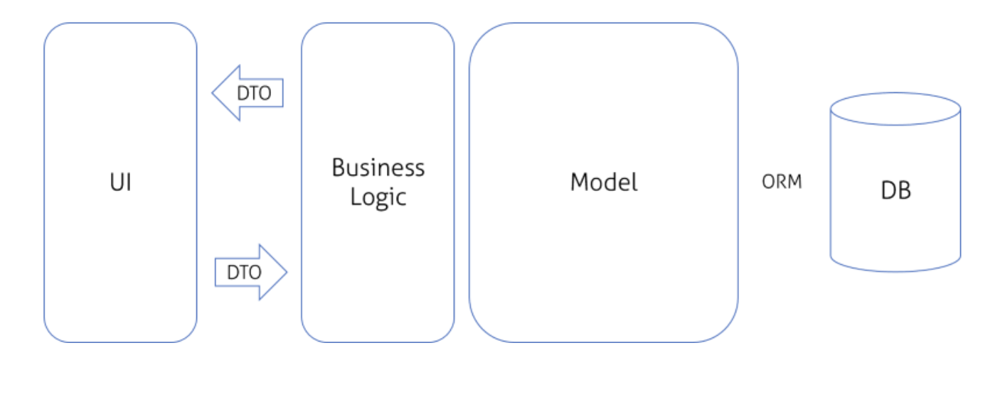
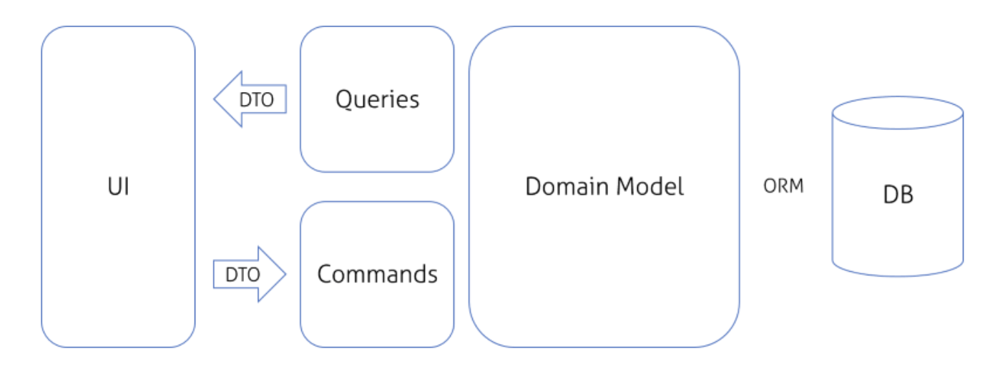
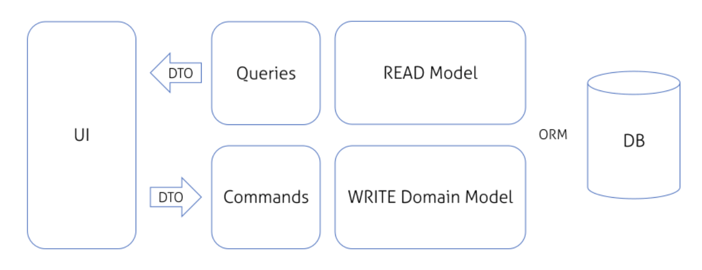
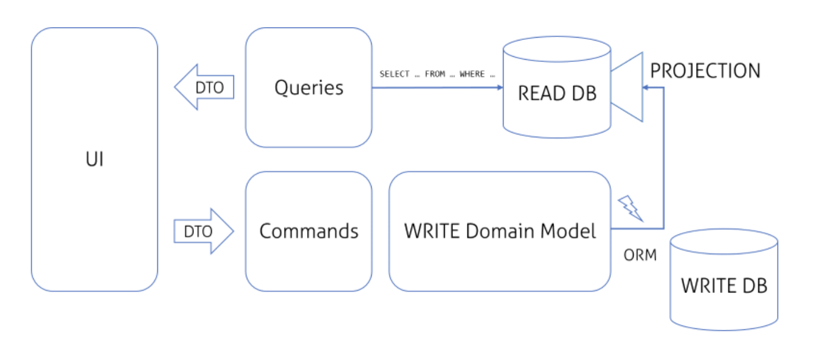

footer: Github: @skynyrd, Twitter, Medium: @surmelianil

#[fit]Practical Introduction to
#[fit]__DDD__ & __CQRS__

---

#__DDD__

* The field for which a system is built. 
    * e.g. Order Management, Account Management
* It's not unusual for an application to span several different domains.

---

#__Model__

> A useful approximation to the problem at hand.
-- Gerry Sussman
<br/>
__Domain Model or Domain Object is a model for domain.__

---

#__Domain Driven Design__

* You have to know what that software is all about. 
* You cannot create a complex ecommerce software system unless you have a good understanding of what ecommerce is all about
* One must understand the __domain of ecommerce__.
* Domain mentioned here can be subdomain _(probably)_.

---

# __Ubiquitous Language__

* A set of terms used by all people involved in the domain, domain model, implementation, and backends. The idea is to avoid translation

---

> Translation blunts communication and makes knowledge crunching anemic. 
-- Eric Evans

---
<br/>
<br/>
#[fit]:open_mouth:

---

* "Oh, you're using 'user' in these cases where I'm using 'account'"
* We lose a direct ability to think clearly about the thing we are building and to let new knowledge flow back and forth between domain and implementation.

---

# __Bounded Context__

* A division of a larger system that has its own ubiquitous language and domain model.
    * Order Management, Claim Management, Shipping Management, Merchant Management

---

#__DDD :heart:__

* Clean Code _(e.g. naming convention)_
* OOP Patterns _(e.g. command invoker)_
* TDD
* CQRS
* Event Driven Architecture


---

# __Rule:__
#[fit]__DOMAIN MODELS NEED TO BE__
#[fit] __CLEAR__

---

__Customer Claim__

|Id (GUID)|PktStatus (int)|
|---|---|
|Number (string)|SAPNumber (string)|
|LFINR (int)|OMSNumber (int)|

---

__Customer Claim__

|Id (Identifier)|Status (ClaimStatus)|
|---|---|
|Type (ClaimType)|Rejection (ClaimRejection)|
|Approval (ClaimApproval)|Quantity (Quantity)|

---

#[fit] __Value Objects__

---

__Which variable type would you use for representing the age of a person?__
[ ] Integer
[ ] Boolean
[ ] String

---

#[fit]Of course, AGE :relieved:

---

# __Hassle-free Sharing__

* Immutable
* Dramatically lowers accidental complexity and cognitive load required to avoid introducing any bug.
* Multi threaded environment

---
# __Hassle-free Sharing__
```java
final class Name {
    private String value;

    public Name(String value) {
        this.value = value;
    }
}
```

---

# __Improved Semantics__

---

```csharp
    public struct Point
    {
        private readonly int x;
        private readonly int y;

        public Point(int x, int y)
        {
            this.x = x;
            this.y = y;
        }

        public override bool Equals(object obj)
        {
            if (ReferenceEquals(null, obj)) return false;
            return obj is Quantity && Equals((Quantity)obj);
        }

        public override string ToString()
        {
            return $"x: {x}, y: {y}";
        }

        public static bool operator ==(Point first, Point second)
        {
            return first.Equals(second);
        }

        public static bool operator !=(Point first, Point second)
        {
            return !(first == second);
        }
    }

```

---

# __Self Validation__

```java
final class Rank {
    private int value;

    public Rank(int value) {
        if (value < 1 || value > 13) {
            throw new InvalidRankValue(value); // Or isValid=False;
        }

        this.value = value;
    }
}
```

---

#__Rule:__
#[fit]__Domain Models are__
#[fit]__First Class Citizens!__

---

```csharp
   public class Claim
    {
        public string Id { get; set; }
        public DateTime CreatedAt { get; set; }
        public DateTime UpdatedAt { get; set; }
        public string LineItemId { get; set; }
        public string Status { get; set; }
        public bool Rejection { get; set; }
        public bool Approval { get; set; }
        public string Type { get; set; }
        public int Quantity { get; set; }
    }
```

---

# __S__{O}__LID__

# __OPEN-CLOSED PRINCIPLE__
> _Software entities (classes, modules, functions, etc.) should be open for extension, but closed for modification._

---

```cs
    public class Claim : AggregateRoot
    {
        public Identifier LineItemId { get; private set;}
        public ClaimStatus Status { get; private set; }
        public ClaimType Type { get; private set; }
        public ClaimRejection Rejection { get; private set; }
        public ClaimApproval Approval { get; private set; }
        public Quantity Quantity { get; private set; }

        public Claim(Identifier lineItemId, ClaimType type, Quantity quantity)
        {
            Id = new Identifier(Guid.NewGuid().ToString());
            CreatedAt = DateTime.Now;
            UpdatedAt = CreatedAt;
            LineItemId = lineItemId;
            Type = type;
            Quantity = quantity;

            AddEvent(new ClaimCreatedEvent());
        }

        // Will continue on the other page
    }

```

---

```csharp
        public void MarkAsApproved(DateTime approvalDate, AdminComment adminComment)
        {
            Approval = new ClaimApproval(approvalDate, adminComment);
            AddEvent(new ClaimIsApprovedEvent(Id, LineItemId, approvalDate));
        }
        
        public void MarkAsRejected(DateTime rejectionDate, RejectionReason reason, AdminComment adminComment)
        {
            Rejection = new ClaimRejection(rejectionDate, reason, adminComment);
            AddEvent(new ClaimIsRejectedEvent(Id, LineItemId, rejectionDate));
        }

        public override void Load(ClaimDocument document)
        {
            // SOME MAPPING HERE
        }

        public override ClaimDocument ToWriteModel()
        {
            // SOME MAPPING HERE
            return claimDocument;
        }
```
---
* They should not call any service.
* Clear domain logic.
* Easy to understand for juniors/new devs.
* __Aggregate Root__ will be held in demo.

---

#[fit] __EVENT DRIVEN ARCHITECTURE__

---



---
# __Event Notification__

* Receiver is decoupled from sender. :sunglasses:
* There is no statement of overall behaviour. :eyes:
    * You can't see the big picture, debugging can be tricky.

---



---

* Sometimes client needs to ask additional questions to the event sender.
  * Address changed, I understand. But Is changed address the default one for the customer or not?
* Client keeps kinda projection of customer db and looks at that instead of asking to the customer service. The projection is the same with the source db.

---

* :sunglasses:
  * Decoupling. If sender service is down, not a problem.
  * Reduced load on sender service. 
* :eyes:
  * Replicated Data => Eventually consistent.

---

# __Event Sourcing__


---

* Naturally event sourced systems: Doctors, Lawyers (Addendum)
* Refactor domain model => Create Migration Script
* Persist events and form the model wrt event set.
* Your domain model continuously changes. But your facts _(events)_ doesn't. 

---

* Secure audit log is important for specially regulated industries. Current state has no meaning for us.
  * e.g. Can balance equal to a column of a sql table ? Or summation of the transactions? It is __first level derivative of the facts on your account.__

---

* __Company can need to get any valuable information that you can't present.__
  * I wanna know how many people are removing items within 5 min before they checkout. 
  * You can extract a report by projections of an event stream any time

---

## __Rolling snapshot__
* Replaying tons of events can not be easy.
* Take a snapshot for the state  in the event stream.
* Look at the snapshot if it is what you want
* Play from there.
* Like a breakpoint.
* Very hard to implement on fast changing systems. 

---

__EVENT SOURCING__

|:sunglasses:|:eyes:|
|---|---|
|Audit|Unfamiliar|
|Debugging|External Systems
|Historic state|Eventual Consistency
|Memory Image| Difficult learning curve

---

#[fit] __CQRS__

---

__N Layered Architecture__

* Easy to implement :sunglasses:
* Best for small apis/not complex domain :sunglasses:
* You can ask anyone :sunglasses:
* Very complex Service classes. :eyes:
* Tend to have deeply coupled components :eyes:
* Easy to create mess (Helpers?) :eyes:



---

__Command Invoker Pattern__

* Enhancement on decoupling
* __Command__ => Allowed to mutate state, void return type, Not idempotent
* __Query__ => Not allowed to mutate state, non void return type, Idempotent
* More easy to understand
* Destruction of huge service classes
* My default choice for small apps.



---

__CQS (Command Query Seperation)__

* Clearly decoupled structure for read and write.
* Quick projections with lightweight Read models
* Dedicated models for a purpose



---

#[fit] __CQRS__

---



---

#__CQRS (Command Query Responsibility Segregation)__

* Generally, you need to scale up/out the query part of the system.
* 99% of your work is reading and you optimize for the write performance. Cool.
* Scaling query is much more easier than scaling command. Because most queries can operate with relaxed consistency.

---

# DEMO

---

# References

```
* Eric Evans Talks and Articles
* Martin Fowler Articles
* https://herbertograca.com/2017/11/16/explicit-architecture-01-ddd-hexagonal-onion-clean-cqrs-how-i-put-it-all-together/
* https://speakerdeck.com/bobbycalderwood/commander-better-distributed-applications-through-cqrs-event-sourcing-and-immutable-logs?slide=2
* https://stackoverflow.com/questions/9495985/cqrs-event-sourcing-validate-username-uniqueness?noredirect=1&lq=1
* https://hackernoon.com/value-objects-like-a-pro-f1bfc1548c72
* https://www.future-processing.pl/blog/cqrs-simple-architecture/
* https://www.yegor256.com/2014/09/16/getters-and-setters-are-evil.html
```