footer: github: @skynyrd | twitter, medium: @surmelianil

# Real-Time Streaming ETL with _Kafka Stack_

---

# The Problem

---

## _How fast_ can we see the latest updates of a product in an e-commerce application?

---


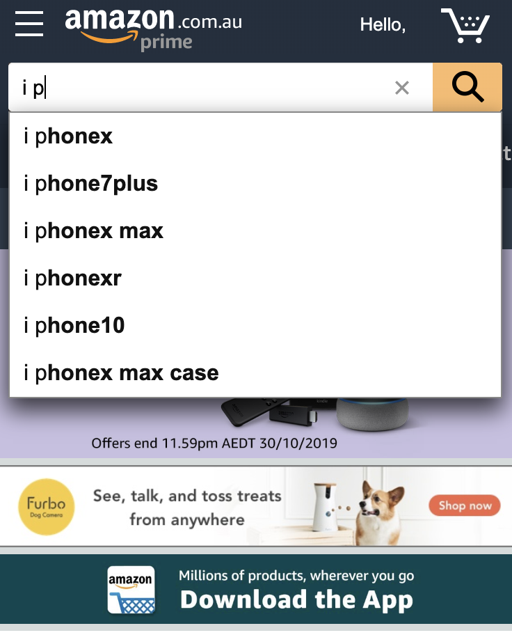

<br/>
<br/>
<br/>

* It must perform well
* You can't cache user input
* It must be durable on high load


---
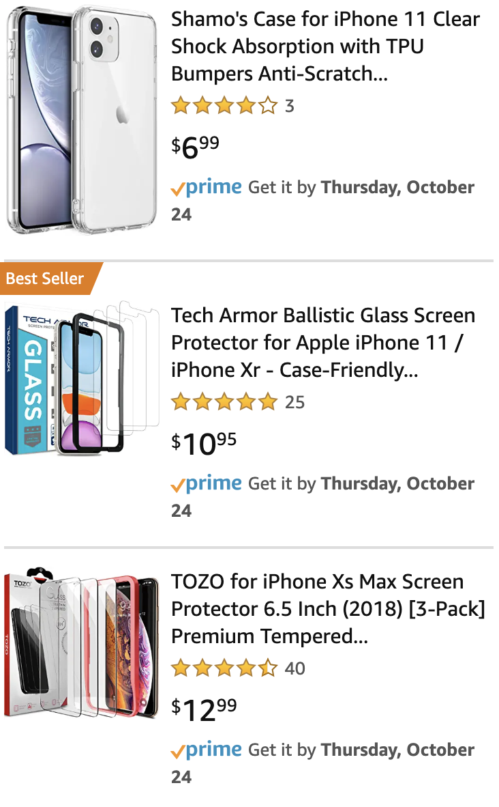

<br/>
<br/>

* Dynamic filters are created with respect to the result set
 * e.g. RAM, Screen Size, Camera etc.
* Also should perform well in milliseconds

---

## Product information should be retrieved from an _additional data store_

---

### Additional Data Sources - Designed for search purposes


---

### Primary Data Sources


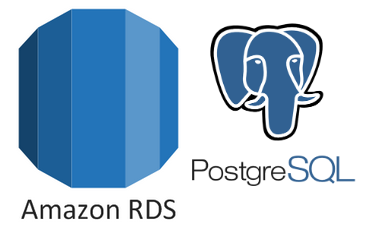

---

# The Common Problem

---


---

# Can we use _Data Source A_ directly ?

---


<br/>

Probably;

* SourceA is not designed for your purpose
* SourceA is not horizontally scalable.
* SourceA is in another domain.
* You need to modify/enhance the data in SourceA

---

# ETL

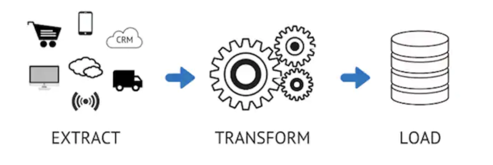

---
[.text: alignment(center)]


# _Traditional ETL_
<br/>
* Pull based systems 
(e.g. cron jobs, schedulers, pull services)
* Not scalable
* Not real-time

---
[.text: alignment(center)]


# _Cool ETL_
<br/>
* Push based
* Real-time streaming
(Less than 20ms)
* Horizontally Scalable

---
[.background-color: #FFF]


---

> Community distributed streaming platform capable of handling trillions of events a day.
-- Confluent Docs

---


_Holden SS UTE: V8 Engine 5.7-litre 225 kW (302 hp)_

* Strong
* Fast
* Fun to operate
<br/>
<br/>

__Most Particularly ==>__

---

# You can _tune_ it!

---


# Horizontuning

---

# _Kafka World_
### Topics, Partitions, Brokers, Zookeeper, Producers, Consumers, Kafka Stream and Kafka Connect

---

## _Topics:_ Stream of data. (Mongo collection, SQL table, Elastic index)

---

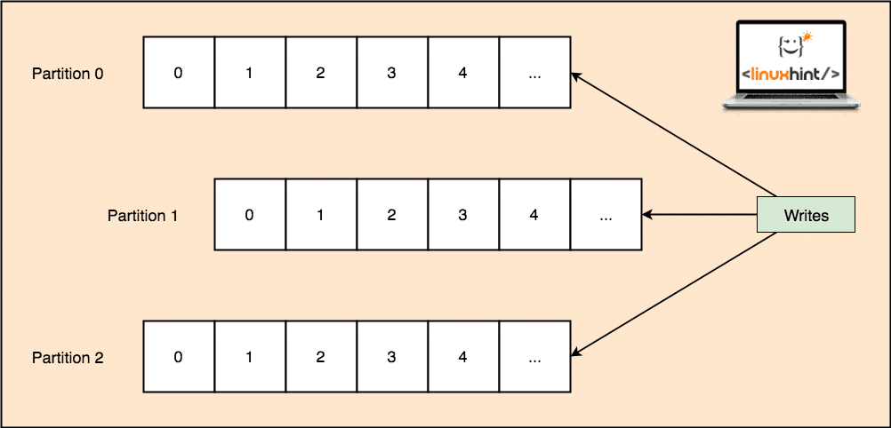

---

## _Brokers:_ Cluster Nodes. Connecting to any broker means connecting to cluster.

---

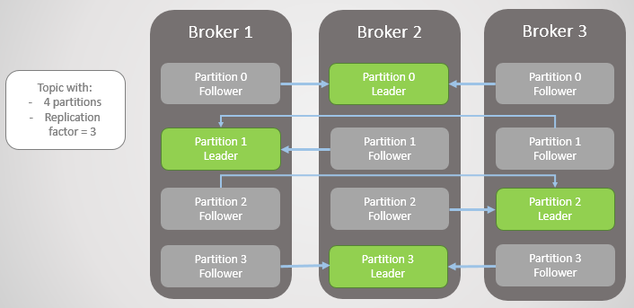

---


# Zookeeper
* Apache project
* Enables reliable distributed coordination
* Brokers are managed by Zookeeper
* Working in a seperate cluster
* No Zookeeper, no Kafka

---
# Producers

---
<br/>
<br/>

* Services that sends data to Kafka
* When broker fails, produces can automatically recover it
* All major languages provide the API

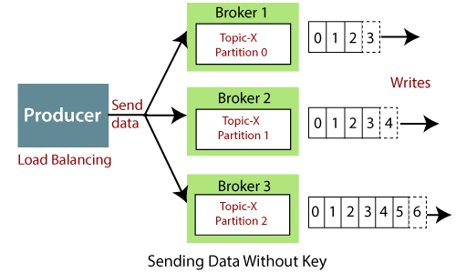

---

## Acknowledgement Strategies

* acks=0 : Fire and forget
* acks=1 : Get ack message from leader partition
* acks=all: Get ack messages from leader and replica partitions

---

# Consumers

* Services that reads data from Kafka
* When broker fails, consumers can automatically recover it
* Works in a consumer group
* Consumer group offsets are stored as a state (in `__consumer_offsets` internal topic)

---

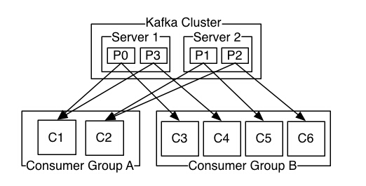

---

Delivery Semantics

* At least once: offsets are commited when the message is received.
* At most once: offsets are commited after message is received and processed
* Exactly once: Only available for Kafka streams

---

# _Kafka Streams_
### Client library for building apps and services, where the input and output data is stored in Kafka Cluster. (Only for Java and Scala)

---

* Encapsulates reading and writing process (Producer + Consumer) 
* "T" in ETL, Transforming the objects
* Reads from a topic/topics, processes it and stores it in a seperate topic.

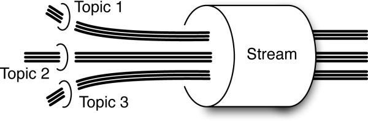

---

# Kafka Connect

---

* Open source component
* Framework to connect external systems such as databases, file systems, twitter?
* `Source` for reading, `Sink` for writing
* Manages the offsets for you, uses Kafka Producers/Consumers internally
* Main advantage: You can use existing implementations

---

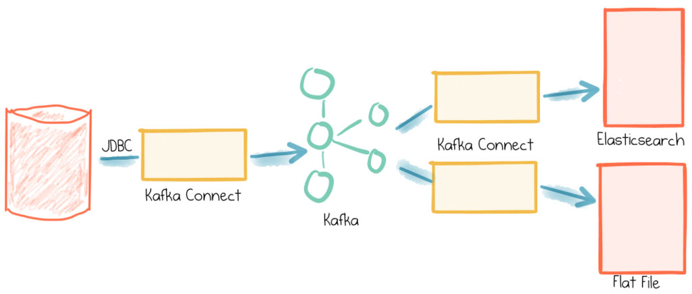

* May be used instead of Consumers and Producers

---

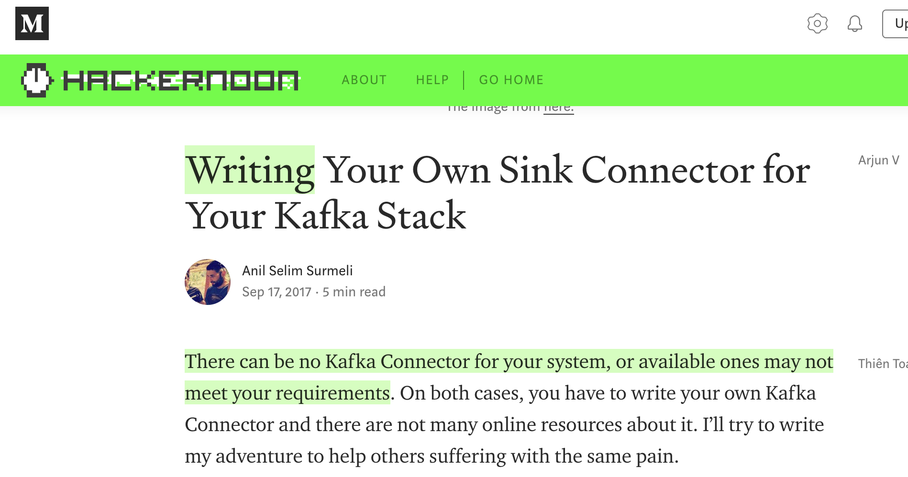

---

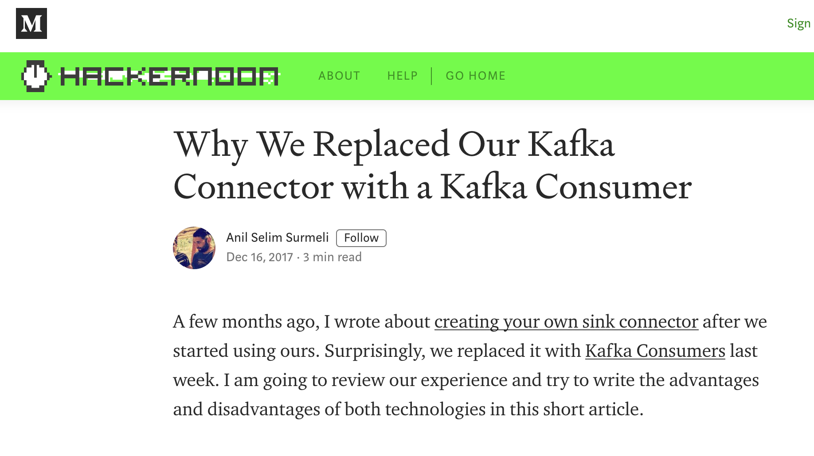

---

# Demo Time!

---

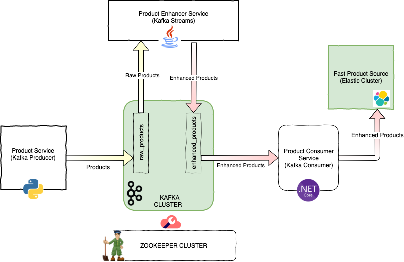

---

# References & Image URLs

```
* Stephane Maarek Courses and Articles
* https://linuxhint.com/apache-kafka-partitioning/
* https://jack-vanlightly.com/blog/2018/9/2/rabbitmq-vs-kafka-part-6-fault-tolerance-and-high-availability-with-kafka
* https://www.javatpoint.com/apache-kafka-producer
* http://javabender.blogspot.com/2017/03/kafka-basics-producer-consumer.html
* https://www.talend.com/resources/what-is-etl/
* https://mapr.com/blog/apache-kafka-and-mapr-streams-terms-techniques-and-new-designs/assets/streaming-post1.jpg
* https://www.confluent.io/blog/simplest-useful-kafka-connect-data-pipeline-world-thereabouts-part-1/
* http://valleymustangsunlimited.com/
```

---

# Many Thanks!
